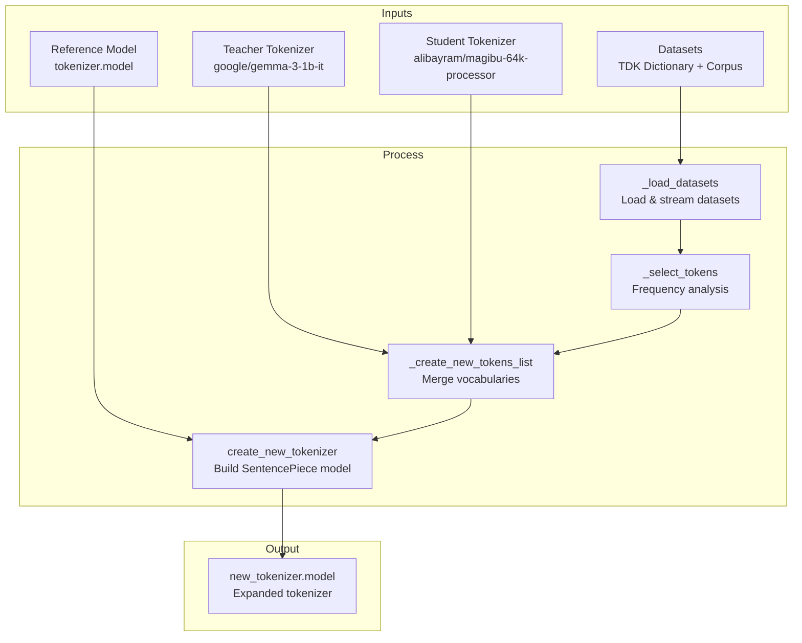

# Gemma Tokenizer Expander - Detailed Documentation

> **Purpose**: This module provides functionality to expand a student tokenizer's vocabulary by incorporating tokens from a teacher tokenizer (Gemma) and frequency-based token selection from text datasets. It creates a new SentencePiece model file with the expanded vocabulary.

---

## Table of Contents

1. [Imports](#imports)
2. [Constants](#constants)
3. [GemmaTokenizerExpander Class](#gemmatokenizerexpander-class)
   - [Constructor (`__init__`)](#constructor-__init__)
   - [String Representation Methods](#string-representation-methods)
   - [Dataset Loading (`_load_datasets`)](#dataset-loading-_load_datasets)
   - [Token Selection (`_select_tokens`)](#token-selection-_select_tokens)
   - [New Tokens List Creation (`_create_new_tokens_list`)](#new-tokens-list-creation-_create_new_tokens_list)
   - [Piece Type Detection (`_get_piece_type`)](#piece-type-detection-_get_piece_type)
   - [Tokenizer Creation (`create_new_tokenizer`)](#tokenizer-creation-create_new_tokenizer)
4. [Usage Example](#usage-example)

---

## Imports

```python
from typing import List, Optional
```

- **`List`**: Type hint for list types, used for type annotations
- **`Optional`**: Type hint indicating a value can be `None` or the specified type

```python
from datasets import Dataset, load_dataset
```

- **`Dataset`**: HuggingFace datasets class for handling tabular data
- **`load_dataset`**: Function to load datasets from HuggingFace Hub or local sources

```python
from huggingface_hub import hf_hub_download
```

- **`hf_hub_download`**: Downloads specific files from HuggingFace Hub repositories (e.g., tokenizer model files)

```python
from sentencepiece import sentencepiece_model_pb2 as sp_model
```

- **`sentencepiece_model_pb2`**: Protocol buffer definitions for SentencePiece models, aliased as `sp_model` for convenience. This allows direct manipulation of the tokenizer's internal structure.

```python
from tqdm import tqdm
```

- **`tqdm`**: Progress bar library to display visual feedback during long-running operations

```python
from transformers import GemmaTokenizerFast
```

- **`GemmaTokenizerFast`**: HuggingFace's fast tokenizer implementation for Gemma models, based on Rust for performance

---

## Constants

### DEFAULT_REF_MODEL_ID

```python
DEFAULT_REF_MODEL_ID = "google/gemma-3-1b-it"
```

The default HuggingFace model ID to use as a reference for downloading the SentencePiece tokenizer model. Points to Google's Gemma 3 1B instruction-tuned model.

---

### FIRST_ADDED_TOKENS

```python
FIRST_ADDED_TOKENS = [
    "<pad>",          # Padding token for batch processing
    "<eos>",          # End of sequence token
    "<bos>",          # Beginning of sequence token
    "<unk>",          # Unknown token for out-of-vocabulary words
    "<mask>",         # Mask token for masked language modeling
    "[multimodal]",   # Special token for multimodal inputs
    *[f"<unused{i}>" for i in range(100)],  # 100 unused placeholder tokens (unused0-unused99)
    "<start_of_turn>",  # Marks the start of a conversation turn
    "<end_of_turn>",    # Marks the end of a conversation turn
    "\n",             # Single newline character
    "\n\n",           # Double newline (paragraph break)
    "▁",              # SentencePiece word boundary marker (single)
    "▁▁",             # Double word boundary marker
    # HTML table tags
    "<table>", "<caption>", "<thead>", "<tbody>", "<tfoot>", "<tr>", "<th>", "<td>",
    "</table>", "</caption>", "</thead>", "</tbody>", "</tfoot>", "</tr>", "</th>", "</td>",
    # HTML heading tags
    "<h1>", "<h2>", "<h3>", "<h4>", "<h5>", "<h6>", "<blockquote>",
    "</h1>", "</h2>", "</h3>", "</h4>", "</h5>", "</h6>", "</blockquote>",
    # HTML formatting tags
    "<strong>", "<em>", "<b>", "<i>", "<u>", "<s>", "<sub>", "<sup>", "<code>",
    "</strong>", "</em>", "</b>", "</i>", "</u>", "</s>", "</sub>", "</sup>", "</code>",
    # HTML structure tags
    "<a>", "<html>", "<body>", "", "<span>", "<bbox>", "<ul>", "<li>", "<div>", "<iframe>", "<footer>",
    "</a>", "</html>", "</body>", "</img>", "</span>", "</bbox>", "</ul>", "</li>", "</div>", "</iframe>", "</footer>",
    # Byte tokens (256 tokens for all possible byte values: 0x00 to 0xFF)
    *[f"<0x{i:02X}>" for i in range(256)],
]
```

This list defines **special tokens that are placed at the beginning of the vocabulary**. The order matters:

- **Control tokens** (pad, eos, bos, unk) are placed first for consistent ID assignment
- **100 unused tokens** provide room for future extensions
- **Conversation tokens** support chat/dialogue formatting
- **HTML tokens** enable structured document handling
- **Byte tokens** (256 total) allow byte-level fallback for unknown characters

---

### LAST_ADDED_TOKENS

```python
LAST_ADDED_TOKENS = [
    "\t",              # Single tab character
    "\t\t",            # Double tab character
    "<start_of_image>", # Marks beginning of image data (multimodal)
    "<end_of_image>",   # Marks end of image data (multimodal)
    *[f"<unused{i}>" for i in range(101, 201)],  # 100 more unused tokens (unused101-unused200)
]
```

Tokens placed at the **end of the vocabulary**. These include:

- **Tab characters** for formatting
- **Image boundary tokens** for multimodal models
- **Additional unused tokens** (101-200) for future expansion

---

## GemmaTokenizerExpander Class

The main class that handles vocabulary expansion.

### Constructor (`__init__`)

```python
def __init__(
    self,
    student_tokenizer_id: str,
    target_vocab_size: int,
    datasets_dicts: List[dict],
    teacher_tokenizer_id: str = DEFAULT_REF_MODEL_ID,
    ref_model_id: str = DEFAULT_REF_MODEL_ID,
    ref_model_path: Optional[str] = None,
):
```

#### Parameters:

| Parameter              | Type            | Description                                                        |
| ---------------------- | --------------- | ------------------------------------------------------------------ |
| `student_tokenizer_id` | `str`           | HuggingFace model ID for the tokenizer to be expanded              |
| `target_vocab_size`    | `int`           | Desired final vocabulary size                                      |
| `datasets_dicts`       | `List[dict]`    | List of dataset configurations for frequency-based token selection |
| `teacher_tokenizer_id` | `str`           | HuggingFace model ID for the source tokenizer (default: Gemma 3)   |
| `ref_model_id`         | `str`           | Model ID for downloading the SentencePiece model structure         |
| `ref_model_path`       | `Optional[str]` | Local path to SentencePiece model (overrides download)             |

#### Implementation Details:

```python
self.teacher_tokenizer = GemmaTokenizerFast.from_pretrained(teacher_tokenizer_id)
```

Loads the teacher tokenizer from HuggingFace Hub. This tokenizer provides the source vocabulary from which new tokens will be selected.

```python
self.student_tokenizer = GemmaTokenizerFast.from_pretrained(student_tokenizer_id)
```

Loads the student tokenizer whose vocabulary will be expanded.

```python
self.target_vocab_size = target_vocab_size - len(LAST_ADDED_TOKENS)
```

Adjusts target size to account for `LAST_ADDED_TOKENS` that will be appended at the end. This ensures the final vocabulary exactly matches the requested size.

```python
self.datasets_dicts = datasets_dicts
```

Stores dataset configurations for later use in frequency analysis.

```python
self.ref_model = sp_model.ModelProto()
```

Creates an empty SentencePiece model protobuf object to store the reference model structure.

```python
if ref_model_path is not None:
    model_path = ref_model_path
else:
    model_path = hf_hub_download(repo_id=ref_model_id, filename="tokenizer.model")
```

Determines the source of the SentencePiece model:

- Uses local path if provided
- Otherwise downloads `tokenizer.model` from HuggingFace Hub

```python
with open(model_path, "rb") as f:
    self.ref_model.ParseFromString(f.read())
```

Opens the model file in binary mode and parses its contents into the protobuf structure. This preserves the model's configuration (trainer_spec, normalizer_spec, etc.).

---

### String Representation Methods

```python
def __str__(self):
    return f"TokenizerExpander(teacher_tokenizer={self.teacher_tokenizer.name_or_path}, student_tokenizer={self.student_tokenizer.name_or_path}, target_vocab_size={self.target_vocab_size}, datasets_dicts={self.datasets_dicts})"
```

Returns a human-readable string representation of the expander instance, showing all key configuration parameters.

```python
def __repr__(self):
    return self.__str__()
```

Uses the same string representation for the `repr()` function, ensuring consistent output in debuggers and logs.

---

### Dataset Loading (`_load_datasets`)

```python
def _load_datasets(self):
    for dataset_dict in tqdm(self.datasets_dicts, desc="Loading datasets"):
```

Iterates through each dataset configuration with a progress bar.

```python
        if dataset_dict.get("limit") is not None:
            dataset = load_dataset(
                dataset_dict["id"],
                dataset_dict["subset"],
                split=dataset_dict["split"],
                streaming=True,
            )
```

If a `limit` is specified, enables **streaming mode** to avoid downloading the entire dataset. This is memory-efficient for large datasets.

```python
            rows = []
            for row in tqdm(range(dataset_dict["limit"]), desc="Loading dataset"):
                rows.append(next(iter(dataset)))
            dataset = Dataset.from_list(rows)
```

Collects only the specified number of rows by iterating through the stream. Creates a new `Dataset` object from the collected rows.

> [!WARNING]
> There's a bug here: `next(iter(dataset))` creates a new iterator each time, always returning the first row. It should use a single iterator variable.

```python
        else:
            dataset = load_dataset(dataset_dict["id"], split=dataset_dict["split"])
```

For datasets without limits, loads the entire dataset at once.

```python
        dataset_dict["dataset"] = dataset
    return self.datasets_dicts
```

Stores the loaded dataset back into the configuration dictionary and returns all configurations.

---

### Token Selection (`_select_tokens`)

```python
def _select_tokens(self):
    if "dataset" not in self.datasets_dicts[0]:
        self._load_datasets()
```

Automatically loads datasets if not already loaded (lazy loading pattern).

```python
    freq_dict = {}
    selected_tokens = set()
```

Initializes:

- `freq_dict`: Dictionary to count token frequencies
- `selected_tokens`: Set to store tokens that meet frequency thresholds

```python
    for dataset_dict in self.datasets_dicts:
        dataset = dataset_dict["dataset"]
        columns = dataset_dict["columns"]
```

Iterates through each dataset and extracts its data and column configuration.

```python
        for row in tqdm(dataset, desc=f"Processing {dataset_dict.get('id')}"):
            text = " ".join(
                row[column] if row[column] is not None else "" for column in columns
            )
```

For each row:

- Concatenates text from all specified columns
- Handles `None` values by replacing with empty strings
- Joins with spaces to create a single text string

```python
            tokens = self.teacher_tokenizer.tokenize(text)
            for token in tokens:
                freq_dict[token] = freq_dict.get(token, 0) + 1
                if freq_dict[token] >= dataset_dict["min_freq"]:
                    selected_tokens.add(token)
```

- Tokenizes the text using the **teacher tokenizer**
- Increments frequency count for each token
- Adds token to selection set once it reaches the `min_freq` threshold

```python
    return selected_tokens
```

Returns the set of tokens that appeared frequently enough in the dataset.

---

### New Tokens List Creation (`_create_new_tokens_list`)

This method orchestrates the vocabulary expansion process.

```python
def _create_new_tokens_list(self):
    student_vocab = self.student_tokenizer.get_vocab()
```

Gets the student tokenizer's vocabulary as a `{token: id}` dictionary.

```python
    removed_tokens = []
    for token in FIRST_ADDED_TOKENS:
        if token in student_vocab:
            del student_vocab[token]
            removed_tokens.append(token)
    for token in LAST_ADDED_TOKENS:
        if token in student_vocab:
            del student_vocab[token]
            removed_tokens.append(token)
```

Removes special tokens from the student vocabulary to avoid duplicates. These will be re-added at their designated positions.

```python
    new_tokens = sorted(student_vocab.items(), key=lambda x: x[1])
    new_tokens = [token for token, _ in new_tokens]
```

Sorts remaining tokens by their original IDs and extracts just the token strings.

```python
    new_tokens = FIRST_ADDED_TOKENS + new_tokens
    student_vocab = {}
    new_vocab_size = len(new_tokens)
```

Prepends `FIRST_ADDED_TOKENS` to the token list and reinitializes tracking variables.

```python
    i = 0
    for token in new_tokens + LAST_ADDED_TOKENS:
        student_vocab[token] = i
        i += 1
```

Rebuilds the vocabulary dictionary with sequential IDs.

```python
    teacher_vocab = self.teacher_tokenizer.get_vocab()
    teacher_vocab_size = len(teacher_vocab)
    first_added_len = len(FIRST_ADDED_TOKENS)
```

Gets teacher vocabulary and calculates constants for position mapping.

#### Adding 1-Letter Tokens:

```python
    for token, id in tqdm(teacher_vocab.items(), desc="Adding 1-letter tokens"):
        if new_vocab_size >= self.target_vocab_size:
            break
        if len(token) == 1 and token not in student_vocab:
            new_token_id = round(id * (new_vocab_size / teacher_vocab_size))
            if new_token_id < first_added_len:
                new_token_id += first_added_len
            new_tokens.insert(new_token_id, token)
            new_vocab_size += 1
            student_vocab[token] = new_vocab_size
```

- Iterates through teacher vocabulary
- Selects single-character tokens not already in student vocabulary
- **Position mapping**: `id * (new_vocab_size / teacher_vocab_size)` scales the original position to the new vocabulary size to maintain relative ordering
- Ensures new tokens aren't inserted into the reserved `FIRST_ADDED_TOKENS` region

#### Adding 2-Letter Tokens:

```python
    for token, id in tqdm(teacher_vocab.items(), desc="Adding 2-letter tokens"):
        # ... same logic for tokens with len(token) == 2
```

Repeats the same process for 2-character tokens.

#### Adding Frequency-Selected Tokens:

```python
    selected_tokens = self._select_tokens()
    for token in tqdm(selected_tokens, desc="Adding selected tokens"):
        if new_vocab_size >= self.target_vocab_size:
            break
        if token not in student_vocab:
            id = teacher_vocab[token]
            new_token_id = round(id * (new_vocab_size / teacher_vocab_size))
            if new_token_id < first_added_len:
                new_token_id += first_added_len
            new_tokens.insert(new_token_id, token)
            new_vocab_size += 1
            student_vocab[token] = new_vocab_size
```

Adds tokens selected based on frequency analysis from the datasets.

#### Adding 3, 4, 5-Letter Tokens:

```python
    for i in range(3, 6):
        if new_vocab_size >= self.target_vocab_size - 1:
            break
        for token, id in tqdm(teacher_vocab.items(), desc=f"Adding {i}-letter tokens"):
            if new_vocab_size > self.target_vocab_size - 1:
                break
            if len(token) == i and token not in student_vocab:
                # ... same insertion logic
```

Continues adding tokens of increasing length (3, 4, 5 characters) until the target size is reached.

```python
    new_tokens.extend(LAST_ADDED_TOKENS)
    return new_tokens
```

Appends the final special tokens and returns the complete token list.

---

### Piece Type Detection (`_get_piece_type`)

```python
def _get_piece_type(self, token: str) -> int:
    if token == "<unk>":
        return 2  # UNKNOWN type
    if token in {"<pad>", "<eos>", "<bos>"}:
        return 3  # CONTROL type
    if token.startswith("<0x"):
        return 6  # BYTE type
    if token == "[multimodal]" or (token.startswith("<") and token.endswith(">")):
        return 4  # USER_DEFINED type
    return 1  # NORMAL type
```

Determines the SentencePiece piece type for a token:

| Type Value | Constant     | Description                                |
| ---------- | ------------ | ------------------------------------------ |
| 1          | NORMAL       | Regular vocabulary token                   |
| 2          | UNKNOWN      | The unknown token (`<unk>`)                |
| 3          | CONTROL      | Control tokens (pad, eos, bos)             |
| 4          | USER_DEFINED | Custom special tokens                      |
| 6          | BYTE         | Byte fallback tokens (`<0x00>` - `<0xFF>`) |

---

### Tokenizer Creation (`create_new_tokenizer`)

```python
def create_new_tokenizer(self):
    new_tokens = self._create_new_tokens_list()
```

Gets the complete expanded token list.

```python
    model = sp_model.ModelProto()
    model.CopyFrom(self.ref_model)
```

Creates a new model protobuf and copies the reference model's configuration (trainer_spec, normalizer_spec, etc.).

```python
    del model.pieces[:]
```

Clears all existing pieces from the copied model. The `pieces` field will be repopulated with the new vocabulary.

```python
    normal_token_score = -0
    added_tokens = set()
```

Initializes:

- `normal_token_score`: Starting score for normal tokens (decrements for each token)
- `added_tokens`: Set to track already-added tokens and prevent duplicates

```python
    for token in tqdm(new_tokens, desc="Creating sentencepiece model"):
        if token in added_tokens:
            continue
        added_tokens.add(token)
```

Skips duplicate tokens.

```python
        piece = model.pieces.add()
        piece.piece = token
        piece_type = self._get_piece_type(token)
        if piece_type > 1:
            piece.type = piece_type
```

Creates a new piece in the model:

- Sets the token string
- Sets the type if it's a special token (type 1/NORMAL is the default, so it's not explicitly set)

```python
        if piece_type > 1:  # UNKNOWN, CONTROL, USER_DEFINED, BYTE
            piece.score = 0
        else:
            piece.score = normal_token_score
            normal_token_score -= 1
```

Assigns scores:

- Special tokens get score 0
- Normal tokens get decreasing negative scores (0, -1, -2, ...)
- Lower scores = lower priority during tokenization (less likely to be selected)

```python
    model.trainer_spec.unk_id = 3
    model.trainer_spec.bos_id = 2
    model.trainer_spec.eos_id = 1
    model.trainer_spec.pad_id = 0
```

Sets the special token IDs in the trainer specification. These correspond to the positions of these tokens in `FIRST_ADDED_TOKENS`:

- `<pad>` is at index 0
- `<eos>` is at index 1
- `<bos>` is at index 2
- `<unk>` is at index 3

```python
    model.trainer_spec.eos_piece = "<eos>"
    model.trainer_spec.bos_piece = "<bos>"
```

Sets the string representations of special tokens.

```python
    model.trainer_spec.vocab_size = len(model.pieces)
    print(
        f"Target vocab size: {self.target_vocab_size + len(LAST_ADDED_TOKENS)}, Current vocab size: {model.trainer_spec.vocab_size}"
    )
```

Updates the vocabulary size in the model specification and logs progress.

```python
    with open("new_tokenizer.model", "wb") as f:
        f.write(model.SerializeToString())
    return "new_tokenizer.model"
```

Serializes the protobuf model to binary format and writes it to a file. Returns the path to the created file.

---

## Usage Example

```python
datasets_dicts = [
    {
        "id": "Ba2han/TDK_Sozluk-Turkish-v2",  # HuggingFace dataset ID
        "columns": ["madde", "anlam", "ornek"],  # Columns to extract text from
        "split": "train",                         # Dataset split to use
        "min_freq": 3,                            # Minimum frequency threshold
    },
    {
        "id": "alibayram/cosmos-corpus-00-5",
        "columns": ["text"],
        "split": "train",
        "min_freq": 1600,  # Higher threshold for larger datasets
    },
]
```

Configures datasets for frequency-based token selection:

- **TDK Dictionary**: Turkish dictionary with lower frequency threshold (3)
- **Cosmos Corpus**: Larger corpus with higher threshold (1600)

```python
expander = GemmaTokenizerExpander(
    teacher_tokenizer_id="google/gemma-3-1b-it",     # Source vocabulary
    student_tokenizer_id="alibayram/magibu-64k-processor",  # Tokenizer to expand
    target_vocab_size=2**17,                         # 131,072 tokens
    datasets_dicts=datasets_dicts,
)
```

Creates an expander instance with:

- **Teacher**: Google's Gemma 3 tokenizer (source vocabulary)
- **Student**: Custom 64K tokenizer to expand
- **Target**: 128K vocabulary size (2^17 = 131,072)

```python
model_file_path = expander.create_new_tokenizer()
```

Executes the expansion process and creates `new_tokenizer.model`.

```python
from transformers import GemmaTokenizerFast
tokenizer = GemmaTokenizerFast.from_pretrained(".", vocab_file=model_file_path)
print(tokenizer.tokenize("Merhaba nasılsınız?"))
```

Loads the newly created tokenizer and tests it with Turkish text ("Hello, how are you?").

---

## Architecture Diagram



---

## Token Insertion Order

The vocabulary expansion follows this priority:

1. **FIRST_ADDED_TOKENS** - Reserved special tokens at the beginning
2. **Existing student vocabulary** - Preserves original tokens
3. **1-letter tokens** from teacher vocabulary
4. **2-letter tokens** from teacher vocabulary
5. **Frequency-selected tokens** from datasets
6. **3, 4, 5-letter tokens** from teacher vocabulary (until target size)
7. **LAST_ADDED_TOKENS** - Reserved tokens at the end

This ordering ensures:

- Special tokens have consistent, predictable positions
- Short tokens (often common subwords) are prioritized
- Domain-specific frequent tokens are included
- The vocabulary grows systematically to the target size
