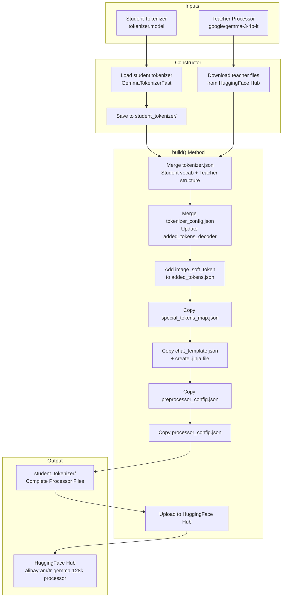
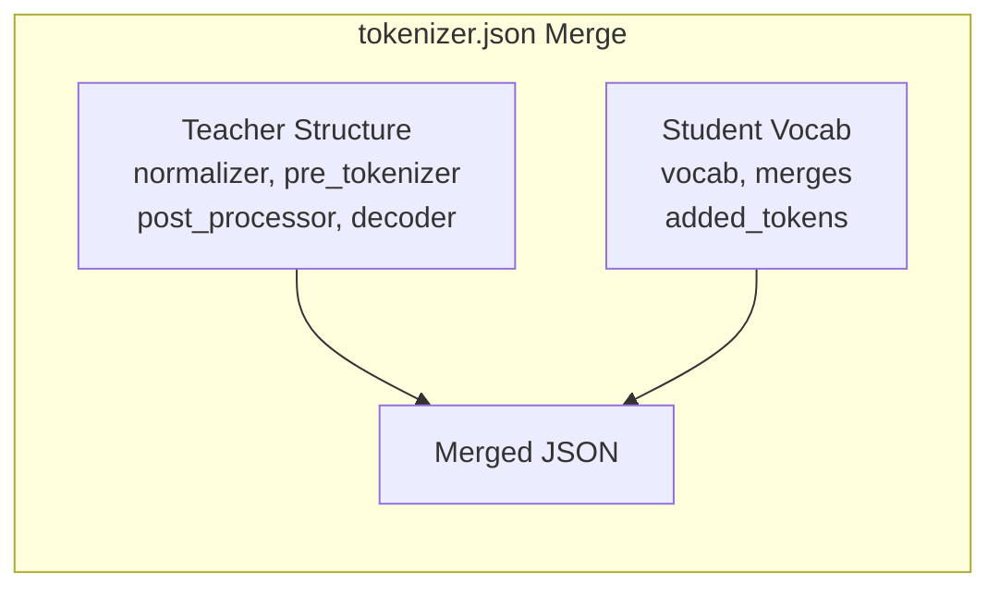

# Processor Builder - Detailed Documentation

> **Purpose**: This module builds a complete Gemma3-compatible processor by combining a custom student tokenizer with configuration files from a teacher processor (Google's Gemma 3). It handles merging tokenizer configurations, adding multimodal tokens, and publishing the result to HuggingFace Hub.

---

## Table of Contents

1. [Imports](#imports)
2. [ProcessorBuilder Class](#processorbuilder-class)
   - [Constructor (`__init__`)](#constructor-__init__)
   - [Build Method (`build`)](#build-method-build)
3. [Output Files](#output-files)
4. [Usage Example](#usage-example)
5. [Architecture Diagram](#architecture-diagram)

---

## Imports

```python
import os
```

- **`os`**: Standard library module for operating system interactions. Used here for listing directory contents with `os.listdir()`.

```python
import json
```

- **`json`**: Standard library module for JSON serialization/deserialization. Used extensively for reading and writing tokenizer configuration files.

```python
import shutil
```

- **`shutil`**: Standard library module for high-level file operations. Used for copying files between directories with `shutil.copyfile()`.

```python
from huggingface_hub import HfApi, hf_hub_download
```

- **`HfApi`**: HuggingFace Hub API client for interacting with repositories (creating repos, uploading files, fetching model info)
- **`hf_hub_download`**: Function to download specific files from HuggingFace Hub repositories

```python
from transformers import GemmaTokenizerFast, Gemma3Processor
```

- **`GemmaTokenizerFast`**: HuggingFace's fast tokenizer implementation for Gemma models
- **`Gemma3Processor`**: Combined processor for Gemma 3 models that handles both text tokenization and image preprocessing (imported but not directly used in this file)

---

## ProcessorBuilder Class

The main class that orchestrates the processor building process.

### Constructor (`__init__`)

```python
def __init__(
    self, student_tokenizer_model_path: str,
    teacher_processor: str = "google/gemma-3-4b-it"
):
```

#### Parameters:

| Parameter                      | Type  | Default                  | Description                                                                |
| ------------------------------ | ----- | ------------------------ | -------------------------------------------------------------------------- |
| `student_tokenizer_model_path` | `str` | Required                 | Path to the SentencePiece model file (`.model`) for the student tokenizer  |
| `teacher_processor`            | `str` | `"google/gemma-3-4b-it"` | HuggingFace model ID for the teacher processor to copy configurations from |

---

#### Step-by-Step Implementation:

```python
student_tokenizer = GemmaTokenizerFast.from_pretrained(
    ".", vocab_file=student_tokenizer_model_path
)
```

Loads the student tokenizer from the current directory using the provided SentencePiece model file. The `"."` indicates the current working directory as the base.

```python
student_tokenizer.save_pretrained("student_tokenizer")
```

Saves the loaded tokenizer to a new directory called `student_tokenizer/`. This creates standard HuggingFace tokenizer files:

- `tokenizer.json` - Main tokenizer configuration
- `tokenizer_config.json` - Tokenizer settings
- `special_tokens_map.json` - Special token mappings

```python
with open("student_tokenizer/tokenizer_config.json", "r") as f:
    self.student_tokenizer_config = json.load(f)

with open("student_tokenizer/tokenizer.json", "r") as f:
    self.student_tokenizer_json = json.load(f)
```

Reads the generated tokenizer configuration files into memory for later modification. These are stored as instance attributes.

```python
shutil.copyfile(
    student_tokenizer_model_path,
    f"student_tokenizer/tokenizer.model"
)
```

Copies the original SentencePiece model file into the output directory. This ensures the vocabulary file is included in the final processor.

```python
api = HfApi()
model_info = api.model_info(teacher_processor)
files = [file.rfilename for file in model_info.siblings]
```

- Creates an HuggingFace API client
- Fetches metadata about the teacher processor repository
- Extracts a list of all files available in the repository

```python
needed_files = [
    "added_tokens.json",
    "chat_template.json",
    "preprocessor_config.json",
    "processor_config.json",
    "special_tokens_map.json",
    "tokenizer.json",
    "tokenizer_config.json"
]
```

Defines the list of configuration files needed from the teacher processor:

| File                       | Purpose                                                   |
| -------------------------- | --------------------------------------------------------- |
| `added_tokens.json`        | Maps special token strings to their IDs                   |
| `chat_template.json`       | Jinja2 template for formatting chat conversations         |
| `preprocessor_config.json` | Image preprocessor settings (resizing, normalization)     |
| `processor_config.json`    | Combined processor configuration                          |
| `special_tokens_map.json`  | Maps special token roles (pad, eos, bos) to token strings |
| `tokenizer.json`           | Main tokenizer configuration and vocabulary               |
| `tokenizer_config.json`    | Tokenizer class settings and parameters                   |

```python
local_files = {}
self.local_dir = f"./{teacher_processor.replace('/', '_')}_files"
for file in needed_files:
    if file in files:
        local_path = hf_hub_download(
            repo_id=teacher_processor,
            filename=file,
            local_dir=self.local_dir,
        )
        local_files[file] = local_path
```

- Creates a local directory path by replacing `/` with `_` in the model ID (e.g., `./google_gemma-3-4b-it_files`)
- Downloads each needed file from the teacher processor repository
- Stores the local paths in a dictionary for reference

---

### Build Method (`build`)

The main method that merges configurations and creates the final processor.

```python
def build(self):
    print("Building new processor with student tokenizer...")
```

Prints a status message indicating the build process has started.

---

#### Phase 1: Merging tokenizer.json

```python
print("Merging tokenizer.json files...")
with open(f"{self.local_dir}/tokenizer.json", "r") as f:
    gemma_tokenizer_json = json.loads(f.read())
```

Loads the teacher's `tokenizer.json` file which contains the full tokenizer structure including normalizers, pre-tokenizers, and post-processors.

```python
with open("student_tokenizer/tokenizer.json", "r") as f:
    tokenizer_json = json.loads(f.read())
    added_tokens = tokenizer_json["added_tokens"]
```

Loads the student tokenizer's JSON and extracts its `added_tokens` list.

```python
    added_tokens.append(
        {
            "id": len(tokenizer_json["model"]["vocab"]),
            "content": "<image_soft_token>",
            "lstrip": False,
            "normalized": False,
            "rstrip": False,
            "single_word": False,
            "special": True
        }
    )
```

**Adds a new multimodal token** `<image_soft_token>` to the vocabulary:

- **`id`**: Assigned the next available ID (vocabulary size)
- **`content`**: The token string itself
- **`lstrip`/`rstrip`**: Whether to strip whitespace on left/right (both False)
- **`normalized`**: Whether the token goes through normalization (False for special tokens)
- **`single_word`**: Whether this token should only match complete words (False)
- **`special`**: Marks this as a special token (True)

> [!IMPORTANT]
> The `<image_soft_token>` is essential for multimodal (vision-language) models. It serves as a placeholder where image embeddings are inserted during processing.

```python
    vocab = tokenizer_json["model"]["vocab"]
    merges = tokenizer_json["model"].get("merges", [])
```

Extracts the vocabulary dictionary and BPE merge rules from the student tokenizer.

```python
gemma_tokenizer_json["added_tokens"] = added_tokens
gemma_tokenizer_json["model"]["vocab"] = vocab
gemma_tokenizer_json["model"]["merges"] = merges
```

**Merges the student vocabulary into the teacher structure**:

- Replaces the teacher's added tokens with the student's (plus the new image token)
- Replaces the teacher's vocabulary with the student's
- Replaces the teacher's merge rules with the student's

This preserves the teacher's tokenizer architecture (normalizer, pre-tokenizer, post-processor) while using the student's vocabulary.

```python
with open("student_tokenizer/tokenizer.json", "w", encoding="utf-8") as f:
    f.write(json.dumps(gemma_tokenizer_json, ensure_ascii=False))
```

Writes the merged tokenizer configuration back to the student directory. The `ensure_ascii=False` preserves Unicode characters (important for non-English tokens).

---

#### Phase 2: Merging tokenizer_config.json

```python
print("Merging tokenizer_config.json files...")
with open(f"{self.local_dir}/tokenizer_config.json", "r") as f:
    gemma_tokenizer_config = json.load(f)
    gemma_tokenizer_config["added_tokens_decoder"] = {}
```

Loads the teacher's tokenizer config and initializes an empty `added_tokens_decoder` dictionary.

```python
for token in added_tokens:
    token_id = str(token["id"])
    del token["id"]
    gemma_tokenizer_config["added_tokens_decoder"][token_id] = token
```

Builds the `added_tokens_decoder` mapping:

- Converts each token's ID to a string (JSON keys must be strings)
- Removes the `id` field from the token object (it becomes the dictionary key)
- Adds each token to the decoder with its ID as the key

> [!WARNING]
> This modifies the `added_tokens` list in-place by removing the `id` field. The `added_tokens` list is still referenced from the earlier merge, so this deletion affects both places.

```python
with open("student_tokenizer/tokenizer_config.json", "w", encoding="utf-8") as f:
    gemma_tokenizer_config["vocab_file"] = "tokenizer.model"
    f.write(json.dumps(gemma_tokenizer_config, ensure_ascii=False))
```

- Sets the `vocab_file` to point to the SentencePiece model file
- Writes the merged configuration to the output directory

---

#### Phase 3: Updating added_tokens.json

```python
print("Extra files copying...")
with open(f"{self.local_dir}/added_tokens.json", "r") as f:
    added_tokens_data = json.load(f)
    added_tokens_data["<image_soft_token>"] = len(vocab)  # new token id
    print(added_tokens_data)
```

- Loads the teacher's `added_tokens.json`
- Adds the new `<image_soft_token>` with its assigned ID
- Prints the updated mapping for verification

```python
with open("student_tokenizer/added_tokens.json", "w", encoding="utf-8") as f:
    print("Added <image_soft_token> to added_tokens.json")
    f.write(json.dumps(added_tokens_data, ensure_ascii=False))
```

Writes the updated added tokens mapping to the output directory.

---

#### Phase 4: Copying Configuration Files

```python
shutil.copyfile(
    f"{self.local_dir}/special_tokens_map.json",
    "student_tokenizer/special_tokens_map.json"
)
```

Copies the special tokens map from the teacher. This file defines which tokens serve as `pad_token`, `eos_token`, `bos_token`, etc.

```python
shutil.copyfile(
    f"{self.local_dir}/chat_template.json",
    "student_tokenizer/chat_template.json"
)
```

Copies the chat template configuration which contains the Jinja2 template for formatting conversations.

```python
with open("student_tokenizer/chat_template.json", "r") as f:
    chat_template = json.load(f)
    template = chat_template["chat_template"]

with open("student_tokenizer/chat_template.jinja", "w", encoding="utf-8") as f:
    f.write(template)
```

Extracts the Jinja2 template string from the JSON and saves it as a standalone `.jinja` file. This provides an alternative way to load the chat template.

```python
shutil.copyfile(
    f"{self.local_dir}/preprocessor_config.json",
    "student_tokenizer/preprocessor_config.json"
)
```

Copies the image preprocessor configuration. This defines image processing parameters like:

- Input size
- Normalization values (mean, std)
- Resizing method
- Color channel ordering

```python
shutil.copyfile(
    f"{self.local_dir}/processor_config.json",
    "student_tokenizer/processor_config.json"
)
```

Copies the main processor configuration that tells HuggingFace which processor class to use.

---

#### Phase 5: Publishing to HuggingFace Hub

```python
print("Processor build complete. New processor is in 'student_tokenizer' directory.")
api = HfApi()
api.create_repo(
    repo_id="alibayram/tr-gemma-128k-processor",
)
```

- Prints completion message
- Creates a new repository on HuggingFace Hub

> [!NOTE]
> The repository ID is hardcoded as `alibayram/tr-gemma-128k-processor`. For reusability, this should be parameterized.

```python
for file in os.listdir("student_tokenizer"):
    api.upload_file(
        repo_id="alibayram/tr-gemma-128k-processor",
        path_or_fileobj=f"student_tokenizer/{file}",
        path_in_repo=file,
    )
```

Iterates through all files in the `student_tokenizer/` directory and uploads each one to the HuggingFace repository.

---

## Output Files

After running `build()`, the `student_tokenizer/` directory contains:

| File                       | Description                                                        |
| -------------------------- | ------------------------------------------------------------------ |
| `tokenizer.model`          | SentencePiece model (binary vocabulary)                            |
| `tokenizer.json`           | Merged tokenizer configuration (student vocab + teacher structure) |
| `tokenizer_config.json`    | Tokenizer settings with added_tokens_decoder                       |
| `added_tokens.json`        | Special token → ID mapping                                         |
| `special_tokens_map.json`  | Role → token mapping (pad, eos, bos, etc.)                         |
| `chat_template.json`       | Chat formatting template (JSON)                                    |
| `chat_template.jinja`      | Chat formatting template (raw Jinja2)                              |
| `preprocessor_config.json` | Image preprocessing settings                                       |
| `processor_config.json`    | Main processor class configuration                                 |

---

## Usage Example

```python
if __name__ == "__main__":
    builder = ProcessorBuilder("student_tokenizer/tokenizer.model")
    builder.build()
```

### Parameters Explained:

1. **`"student_tokenizer/tokenizer.model"`**: Path to the SentencePiece model file created by `GemmaTokenizerExpander`

### Workflow:

1. Run `GemmaTokenizerExpander` first to create `new_tokenizer.model`
2. Create a `ProcessorBuilder` with the model path
3. Call `build()` to generate all processor files
4. Files are automatically uploaded to HuggingFace Hub

### Custom Usage:

```python
# Use a different teacher processor
builder = ProcessorBuilder(
    student_tokenizer_model_path="path/to/your/tokenizer.model",
    teacher_processor="google/gemma-3-12b-it"  # Different model size
)
builder.build()
```

---

## Architecture Diagram



---

## File Merge Strategy



The merge strategy preserves:

- **From Teacher**: Tokenizer architecture (how to process text)
- **From Student**: Vocabulary (what tokens exist)

This allows using a custom vocabulary while maintaining compatibility with the Gemma 3 model's expected tokenization behavior.

---

## Key Considerations

> [!CAUTION]
> The `<image_soft_token>` ID is assigned based on the student vocabulary size. If the vocabulary changes, this ID will also change, potentially breaking compatibility with previously trained models.

> [!TIP]
> To use a custom repository name, modify the hardcoded `repo_id` in the `build()` method or refactor it to accept a parameter.
